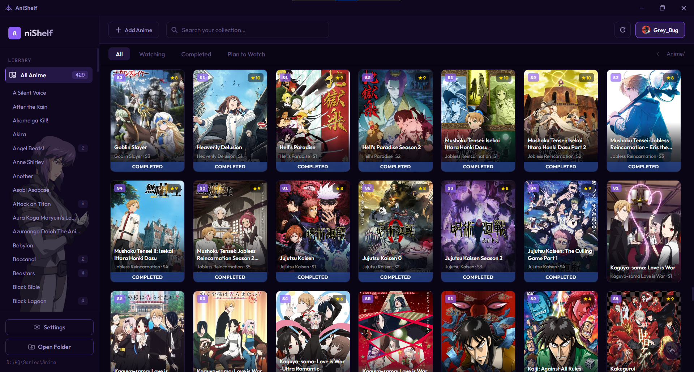

# AniShelf

Anime library manager with wireless SMB2/3 transfer to Android.

Built with Tauri (Rust) for Windows and Kotlin/Jetpack Compose for Android.



## Features

### Desktop App (Tauri)
- Browse and manage your anime collection locally
- Wireless file transfer to Android devices via SMB2/3 protocol
- Fast and lightweight native application

### Android Companion App
- SMB server running on your Android device
- Real-time transfer log with progress tracking
- Shared folder management (internal storage, SD card)
- WebView-based UI with dark theme
- Built on Kotlin + Jetpack Compose with native C++ SMB implementation

## Getting Started

### Desktop

```bash
npm install
npm run tauri dev
```

### Android

Open `android/` in Android Studio, sync Gradle, and run on a device.

## Build

### Desktop
```bash
npm run tauri build
```

### Android
```bash
cd android
./gradlew assembleRelease
```

## Tech Stack

| Component | Technology |
|-----------|------------|
| Desktop Frontend | Vanilla HTML/CSS/JS |
| Desktop Backend | Rust (Tauri v1.6) |
| Android UI | Kotlin, Jetpack Compose |
| Android DI | Hilt |
| SMB Protocol | Native C++ (JNI) |
| Transfer Protocol | SMB2/3 (desktop → Android) |

## License

Desktop: MIT · Android: Apache 2.0 (see `android/LICENSE`)

---

## فارسی

مدیریت کتابخانه انیمه با انتقال بی‌سیم SMB2/3 به اندروید. این پروژه شامل دو بخش است:

- **برنامه دسکتاپ (Windows)** — ساخته شده با Tauri و Rust، مدیریت آنی‌های محلی و ارسال بی‌سیم به گوشی
- **برنامه اندروید** — ساخته شده با Kotlin و Jetpack Compose، اجرای سرور SMB روی گوشی برای دریافت فایل از ویندوز

نسخه اندروید از پروتکل SMB2/3 بومی (C++ JNI) استفاده می‌کند و قابلیت مدیریت پوشه‌های اشتراکی، مشاهده لاگ انتقال و تنظیمات پورت و رمز عبور را دارد.
